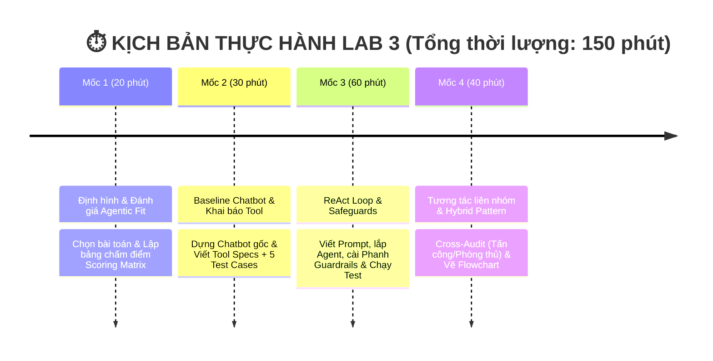

# 🏫 BÀI LAB 3: CHATBOT VS REACT AGENT - TỪ Ý TƯỞNG ĐẾN THỰC THI

---

### 💡 1. LỜI NÓI ĐẦU & NỀN TẢNG LÝ THUYẾT (4 CẤP ĐỘ AI HỘI THOẠI)

Bài Lab giúp bạn hiểu rõ sự tiến hóa qua 4 cấp độ của hệ thống AI:

| Cấp độ | Loại hệ thống | Đặc điểm chính | Sự xuất hiện trong Bài Lab |
| :---: | :--- | :--- | :--- |
| **Cấp 1** | **Rule-Based Bot** | Khớp từ khóa if/else cố định, không có LLM | *Minh họa lịch sử* |
| **Cấp 2** | **LLM Chatbot** | Dùng LLM sinh text mượt, nhưng không gọi được Tool | **Chatbot Baseline** (Phần thực hành 1) |
| **Cấp 3** | **Reactive Agent** | Suy luận `Thought -> Action -> Observation` & gọi Tool | **ReAct Agent Loop** (Trọng tâm Bài Lab) |
| **Cấp 4** | **Autonomous Agent** | Tự rã mục tiêu (Planning), tự đánh giá & có Memory | 🎁 **Phần Bonus Nâng cao (+10%)** |

* 🤖 **Chatbot thông thường (Cấp 2)**: Giống như một **chuyên gia lý thuyết** — chỉ trả lời dựa trên kiến thức tĩnh có sẵn trong LLM, không thể tra cứu số liệu thực tế hay tự thực hiện thao tác.
* 🧠 **ReAct Agent (Cấp 3)**: Giống như một **trợ lý thực hành** — vừa biết suy nghĩ (**Thought**), vừa biết chủ động dùng công cụ (**Action**) như phần mềm tra cứu/tính toán, và quan sát kết quả (**Observation**) để giải quyết các bài toán thực tế.

---

### 📂 2. CẤU TRÚC THƯ MỤC DỰ ÁN

```text
📁 Day-3-Lab-Chatbot-vs-react-agent-E402/
├── 📄 README.md                 <-- 📘 Tổng quan bài Lab & Thang điểm
├── 📄 .env.example              <-- 🔑 File mẫu API Key
├── 📄 requirements.txt          <-- 📦 Thư viện cần cài đặt (cho CLI)
├── 📄 requirements-web.txt      <-- 📦 Thư viện cần cài đặt (cho Web UI)
│
├── 📁 config/                   <-- 🛠️ CẤU HÌNH & DỮ LIỆU
│   └── 📄 test_cases.json       <-- 🟢 [Role 1] Bộ đề 5 Test Cases thử thách AI
│
├── 📁 src/                      <-- 💻 MÃ NGUỒN PYTHON (BOILERPLATE)
│   ├── 📄 tools.py              <-- 🛠️ [Role 2] Khai báo các công cụ (Tools)
│   ├── 📄 prompts.py            <-- 🧠 [Role 3] ReAct System Prompt & Guardrails
│   ├── 📄 providers.py          <-- 🔌 Multi-Provider LLM Adapter (Hỗ trợ Groq)
│   ├── 📄 app.py                <-- 🚀 [Role 4] Core App ghép nối & chạy ReAct Loop (Chế độ CLI)
│   ├── 📄 web.py                <-- 🌐 Backend FastAPI hỗ trợ SSE Streaming (Web UI)
│   └── 📁 static/               <-- 🎨 Frontend (HTML/CSS/JS) với giao diện Premium Glassmorphism
│
└── 📁 docs/                     <-- 📚 TÀI LIỆU HƯỚNG DẪN & BÁO CÁO
    ├── 📄 CODELAB.md            <-- 🎓 [LMS Format] Hướng dẫn thực hành từng bước Codelab
    ├── 📄 PHAN_CONG_CONG_VIEC.md <-- 📋 [BẮT ĐẦU TẠI ĐÂY] Sổ tay thực hành & Checklist 5 Roles
    ├── 📄 DANH_SACH_DE_TAI.md    <-- 💡 Danh sách 10 chủ đề gợi ý
    └── 📄 trace_eval.md          <-- 📊 [Role 5] Báo cáo Log Trace & Đánh giá Agentic Fit
```

---

### ⏱️ 3. LỘ TRÌNH THỰC HÀNH (4 MỐC / 150 PHÚT)



---

### 💯 4. CƠ CHẾ CHẤM ĐIỂM  (SCORING RUBRIC)

| Tiêu chí                                |  Trọng số  | Mô tả chi tiết                                                                                                             | Bằng chứng kiểm tra (Artifacts)                                        |
| :---------------------------------------- | :-----------: | :---------------------------------------------------------------------------------------------------------------------------- | :------------------------------------------------------------------------ |
| **1. Agentic Fit & Test Design**    | **20%** | Phân tích đúng 4 tiêu chí Agentic Fit cho chủ đề tự chọn. Bộ test cases đủ góc cạnh (đơn giản, multi-step, edge cases). | Bảng chấm điểm (`docs/trace_eval.md`) + `config/test_cases.json`. |
| **2. ReAct Implementation & Tools** | **30%** | Tool description rõ ràng. Vòng lặp ReAct chạy đúng chuẩn `Thought -> Action -> Observation`.                         | Code trong `src/tools.py` + `src/app.py`.                              |
| **3. Guardrails & Observability**   | **20%** | Bắt được lỗi loop, có max iterations (Guardrail). Trích xuất được ít nhất 1 Trace log hoàn chỉnh.                     | File `src/prompts.py` + Log trong `docs/trace_eval.md`.                |
| **4. Inter-group Attack & Defense** | **20%** | Phản biện tốt khi gọi ngẫu nhiên hoặc cử 1 bạn đi chấm chéo (+10đ). Agent chống đỡ tốt / fallback chuẩn (+10đ).        | Biên bản Cross-Audit / Trả lời phản biện.                             |
| **5. Hybrid Decision Flowchart**    | **10%** | Sơ đồ thể hiện rõ khi nào đi Chatbot path, khi nào đi ReAct Agent path.                                             | Sơ đồ Flowchart (`docs/hybrid_flowchart.mermaid`).                   |
| 🎁 **BONUS: Autonomous Agent**     | **+10%**| Thử nghiệm tính năng Planning (tự chia nhỏ mục tiêu) hoặc Memory cho Agent (Cấp 4).                                  | Demo code trong `src/app.py` hoặc giải trình trong report.           |

---

> 🚀 **BẮT ĐẦU LÀM BÀI**:
> Vui lòng mở sổ tay thực hành 👉 **[PHAN_CONG_CONG_VIEC.md](file:///c:/Users/Admin/Documents/VinUni/LabCoachVin/LabKeyCoach/Day-3-Lab-Chatbot-vs-react-agent-E402/docs/PHAN_CONG_CONG_VIEC.md)** để xem phân vai và checklist công việc cụ thể cho từng thành viên!

---

### 🌐 5. HƯỚNG DẪN CHẠY DỰ ÁN (MỚI: BẢN PREMIUM WEB UI)

Dự án đã được nâng cấp với giao diện **Web UI Glassmorphism** và hỗ trợ **Groq Provider** cùng cơ chế Streaming (Server-Sent Events) theo thời gian thực.

**👉 Cài đặt thư viện Web:**
```bash
pip install -r requirements-web.txt
```

**👉 Chạy giao diện Web (FastAPI):**
```bash
python -m uvicorn src.web:app --host 127.0.0.1 --port 8000 --reload
```
Sau đó truy cập trình duyệt tại `http://127.0.0.1:8000` để sử dụng.

**👉 Chạy giao diện CLI (Interactive Chat):**
```bash
python src/app.py --interactive
```
